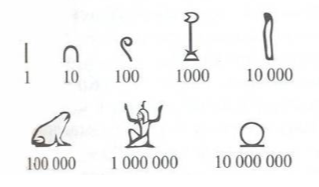
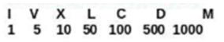
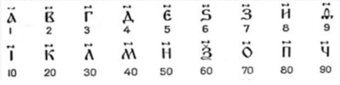

# О системах счисления

Малыш загибает пальчики на руке. Нечесаный, закутанный в шкуры человек рисует углем черточки на камне. Одетый в белоснежное жрец выводит изящные круги и завитушки на листе папируса… Я нажимаю NumLock на клавиатуре и набираю `12345…` 

Что общего между мной и тем дикарем, выводящим черточку за черточкой? Мы записываем числа. Только я делаю это быстрее. И не только потому, что мой инструмент – компьютер – более совершенен. Я использую более удобный и совершенный принцип записи числа – другую, нежели он, систему счисления.

## Что же такое система счисления?

Определение таково: символический метод записи чисел, представление чисел с помощью письменных знаков. Или: совокупность правил и приемов записи чисел с помощью набора цифровых знаков.

Итак, есть некие символы, необязательно цифры, и правила, определяющие то, как надо трактовать последовательность этих символов – число.

## Какими они бывают

Системы счисления делятся на позиционные и непозиционные. В непозиционной системе счисления величина, обозначаемая символом, фиксирована и не зависит от его положения в записи числа.

Самая простая и самая древняя непозиционная система счисления – унарная. Помните нашего дикаря? 

В качестве базового символа в такой системе могло использоваться все что угодно: единичная линия, камешек, отдельный узелок на веревке. Сколько узелков (черточек, камешков) – такова величина числа. Недостаток очевиден: слишком длинная запись числа получается. Если я пишу про 10 коров – еще терпимо, а если про 100?

Чтобы сделать запись числа короче, додумались ввести отдельные обозначения еще для нескольких величин. В Древнем Египте это были числа, кратные 10:

В Древнем Риме: 1, 5, 1*10, 5*10 и т. д.

На Руси: 1, 2, … 9, 1 * 10, 2 * 10, … 9 * 10, 1 * 100 и т. д. Как и в Древнем Риме, для обозначения чисел использовались буквы со специальным символом – титло – над ними.

**Недостатки, правда, у такой идеи прежние:**

- слишком длинная запись, например, число 73 в римской системе записывалось как LXXIII;
- не самые простые правила трактовки записи;
- неудобно производить арифметические операции над числами.

## А что с позиционной системой?

Позиционная система счисления устроена сложнее. В ней есть основание, определяющее «вес» разряда, а заодно количество цифр, которые используются для записи числа, сами цифры и разряд – место цифры в записи числа. 

Значение каждого числового знака (цифры) в записи числа зависит от его позиции (разряда)! Вот она, суть. Если в непозиционной системе все цифры – «рядовые» и имеют одинаковый вес, то в позиционной у нас шеренга – от новобранца до генерала; чем ближе к началу, тем «тяжелее» очередной боец.

Давай разберемся, как это работает, на примере современной десятичной системы счисления. Пусть мы имеем запись числа, например: 12345. Что это означает:

**5 * 100 + 4 * 101 + 3 * 102 + 2 * 103 + 1 * 104?**

10 – основание системы счисления; степень, в которую возводится десятка, – номер разряда – позиции цифры в записи числа. Вот эта 10n и есть вес.

Для справки: нет единого мнения насчет того, кто изобрел современную, «арабскую», систему счисления, которую мы используем. Доподлинно известно, что в средневековую Европу ее принесли именно арабы, а широкое распространение она получила не ранее XVI века. 

Это была настоящая революция в математике! Дроби, простые и десятичные, а также «любимые» школьниками логарифмы появились после введения позиционной десятичной системы счисления.

Позиционную систему счисления можно построить по любому основанию. Принцип один и тот же: основание и набор цифр. Однако наибольшее практическое значение имеют двоичная, десятичная, восьмеричная и шестнадцатеричная. Причем последние две используются в основном не для вычислений, а для представления двоичного кода в форме, удобной для человека.

Зная, как устроены системы счисления, можно сформулировать правила перевода из одной системы в другую. Проще всего осуществлять перевод между системами, у которых

основания – степень одного числа: двоичной, восьмеричной, шестнадцатеричной. Сложнее переходить от десятичной записи к двоичной и т. п. и наоборот. Впрочем, это тема для отдельного разговора.

# Habr

И вот ещё более замечательная [статья](https://habr.com/ru/articles/124395/), которая является отличным дополнением к текущей.
