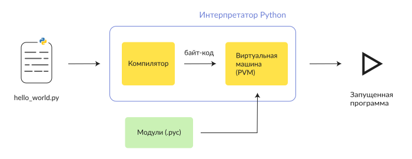
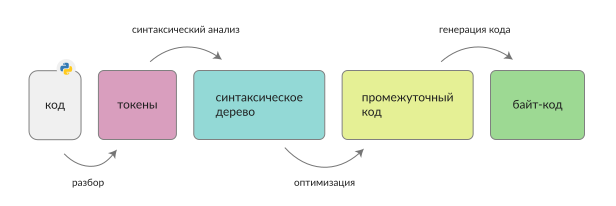

# Как работает Python: интерпретатор, байт-код, PVM

Python — интерпретируемый язык программирования. Он не конвертирует свой код в машинный, который понимает железо (в отличие от С и С++). Вместо этого, Python-интерпретатор переводит код программы в байт-код, который запускается на виртуальной машине Python (PVM). Давайте рассмотрим подробнее, как это работает на примере самой популярной реализации интерпретатора — CPython.

**Интерпретатор** — это программа, которая конвертирует ваши инструкции, написанные на Python, в байт-код и выполняет их. По сути интерпретатор — это программный слой между вашим исходным кодом и железом.

## Существует 2 типа интерпретаторов:

- **Простой интерпретатор**. Он берет одну инструкцию, транслирует и сразу выполняет ее, а затем берет следующую инструкцию.

- **Интерпретатор компилирующего типа**. Это система из компилятора и интерпретатора. Компилятор переводит исходный код программы в промежуточное представление (байт-код), а интерпретатор (виртуальная машина) выполняет этот байт-код.

## CPython:

- Интерпретатор компилирующего типа (благодаря этому достигается большее быстродействие выполнения программ).
- Считается эталонной реализацией языка Python.
- Написан на C.
- Исходный код CPython находится в открытом доступе.
- Его разработка ведётся группой разработчиков под руководством Гвидо ван Россума — создателя Python.

Кроме этого, у интерпретатора CPython есть особенность — он может работать в режиме диалога (`REPL — read-eval-print loop`). Интерпретатор считывает законченную конструкцию языка, выполняет её, печатает результаты и переходит к ожиданию ввода пользователем следующей конструкции.

# Как CPython выполняет программы

Интерпретатор "Питона" выполняет любую программу поэтапно.

`Поэтапное выполнение Python-программы Интерпретатором.`

## Этап #1. Инициализация

После запуска вашей программы, Python-интерпретатор читает код, проверяет форматирование и синтаксис. При обнаружении ошибки он незамедлительно останавливается и показывает сообщение об ошибке. 

**Помимо этого, происходит ряд подготовительных процессов:**

- анализ аргументов командной строки;
- установка флагов программы;
- чтение переменных среды и т.д.

## Этап #2. Компиляция

Интерпретатор транслирует (переводит) исходные инструкции вашей программы в байт-код (низкоуровневое, платформонезависимое представление исходного текста). Такая трансляция необходима в первую очередь для повышения скорости — байт-код выполняется в разы быстрее, чем исходные инструкции.

`Этапы генерации байт-кода из исходного кода на Python.`

Если Python-интерпретатор обладает правом записи, он будет сохранять байт-код в виде файла с расширением `.pyc`. Если исходный текст программы не изменился с момента последней компиляции, при следующем запуске вашей программы, Python сразу загрузит файл `.pyc`, минуя этап компиляции (тем самым ускорит процесс запуска программы).

## Этап #3. Выполнения

Как только байт-код скомпилирован, он отправляется на виртуальную машину Python (PVM). Здесь выполняется байт-код на PVM. Если во время этого выполнения возникает ошибка, то выполнение останавливается с сообщением об ошибке.

PVM является частью Python-интерпретатора. По сути это просто большой цикл, который выполняет перебор инструкций в байт-коде и выполняет соответствующие им операции.

## Альтернативы CPython

CPython является стандартной реализацией, но существуют и другие реализации, созданные для специфических целей и задач.

### Jython
Основная цель данный реализации — тесная интеграция с языком Java. Работает следующим образом:

- Java-классы выполняют компиляцию программного кода на языке Python в байт-код Java.
- Полученный байт-код запускается на виртуальной машине Java (JVM).

`Jython` позволить Python-программам управлять Java-приложениями. Во время выполнения такая программа ведет себя точно так же, как настоящая программа на языке `Java`.

### IronPython

Предназначена для обеспечения интеграции Python-программ с `C#`приложениями на Microsoft `.NET Framework` или `Mono`. Принцип работы такой же, как и у `Jython`.

### PyPy

PyPy — это интерпретатор Python, написанный на Python (если быть точнее, то на RPython).

Особенностью PyPy является использование трассирующего JIT-компилятора (`just-in-time`), который на лету транслирует некоторые элементы в машинный код. Благодаря этому, при выполнении некоторых операций PyPy обгоняет CPython в несколько раз. Но плата за такую производительность — более высокое потребление памяти.

# Что ещё интересного?

1) [Пример установки](https://metanit.com/python/tutorial/1.2.php) интерпретатора и запуска кода

2) [Потрясающая статья](https://habr.com/ru/companies/piter/articles/720724/) **Гид по интерпретатору Python**
